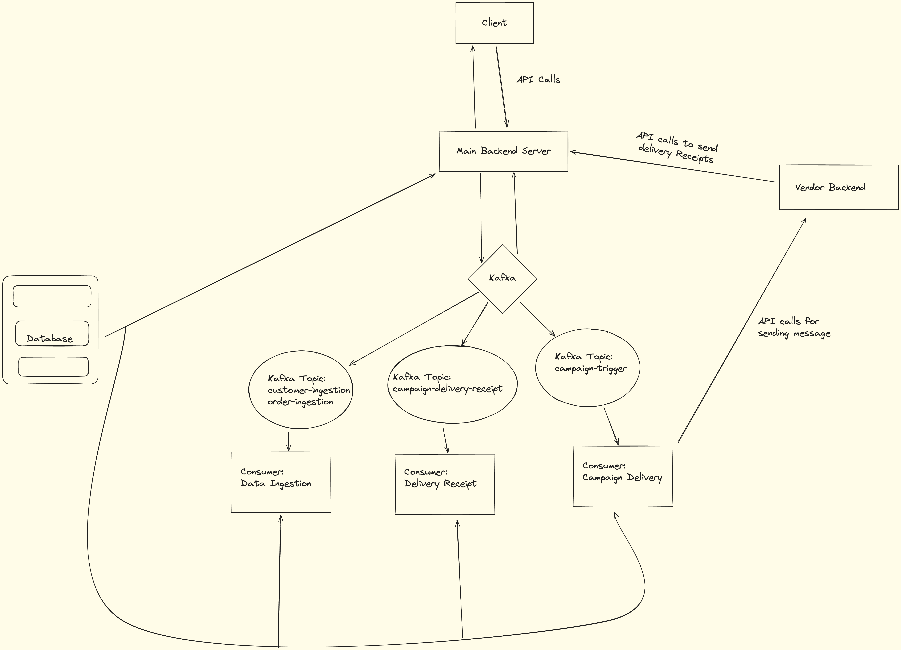
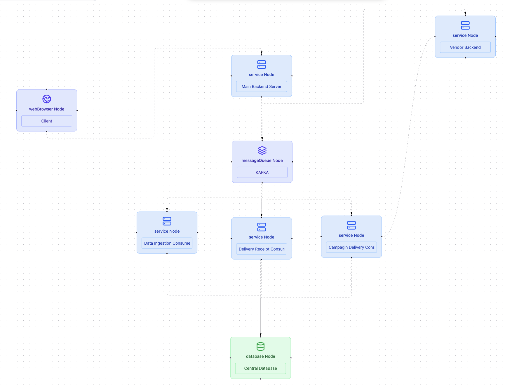

# Xeno-CRM 🚀

An AI-powered Mini CRM Platform built for the Xeno SDE Internship Assignment 2025.  
This platform enables customer segmentation, personalized campaign delivery, and insightful performance summaries using modern technologies and Gemini AI.

## 🌐 Live Demo

- **Frontend**: https://xeno-crm-lac.vercel.app/  
- **Backend**: https://xeno-crm-backend-s4zc.onrender.com  
- **Vendor Mock API**: https://xeno-crm-vendor-backend-bndb.onrender.com  
- **HealthCheck Service**: https://xeno-crm-healthcheck.onrender.com  

## 📺 Demo Video

👉 [Video Explanation](https://drive.google.com/file/d/1bPbh0AILAYWg6dovT06_7eT07ocnbG1d/view?usp=sharing)

## 📂 GitHub Repository

🔗 https://github.com/Gzie3009/XENO-CRM

---

## 🧠 AI Features (via Gemini API)

1. **Rule Generation from Natural Language**  
   Converts human-friendly prompts like _"people who haven’t shopped in 6 months and spent over ₹5K"_ into logical audience segmentation rules.

2. **Message Suggestions**  
   AI generates 2–3 message variants based on a campaign objective like _"bring back inactive users"_.

3. **Delivery Performance Summaries**  
   Transforms raw stats into human-readable summaries, e.g.,  
   _"Your campaign reached 1,284 users. 1,140 messages were delivered. Customers with > ₹10K spend had a 95% delivery rate."_

4. **Campaign Label Generation**  
   AI auto-tags campaigns as _“Win-back”_, _“High Value Customers”_, etc., based on message and audience context.

💡 **Why Gemini AI?**  
Gemini APIs enabled intelligent text analysis and content generation, dramatically improving CRM usability and automation without manual rule setup or content writing.

---

## ⚙️ Tech Stack

| Module            | Stack                                       |
|-------------------|---------------------------------------------|
| Frontend          | React.js (Vite), TailwindCSS                |
| Backend           | Node.js, Express.js, MongoDB                |
| Pub/Sub           | Apache Kafka (via Docker locally, cloud-managed in prod) |
| Consumers         | Node.js, Kafka                              |
| AI Integration    | Gemini API (Google)                         |
| Auth              | Google OAuth 2.0                            |
| Deployment        | Vercel (frontend), Render.com (services)    |

---

## 🏗️ Architecture




### Module Overview

- `frontend/`: React-based UI with rule builder, campaign dashboard, and OAuth.
- `backend/`: API server for auth, ingestion, campaign management. Integrated with Kafka and MongoDB.
- `brokers/`: Docker-based Kafka setup for local development.
- `consumers/`:  
  - `campaign-delivery-consumer`: Sends messages via vendor.  
  - `data-ingestion-consumer`: Stores customer/order data.  
  - `delivery-receipt-consumer`: Updates delivery logs asynchronously.
- `vendor-backend/`: Mocks vendor behavior (~90% success, ~10% failure).
- `healthcheck/`: Keeps services warm using cron pings (free tier hosting workaround).

---

## 🔐 Authentication

- Uses **Google OAuth 2.0** for secure login.
- All protected routes (audience creation, campaign view) require authentication.

---

## 📬 Campaign Workflow Summary

1. **Audience Segment Creation**:
   - Dynamic rule builder supports nested AND/OR logic.
   - Optionally uses AI prompt for rule generation.
   - Shows preview audience size before saving.

2. **Campaign Creation**:
   - Triggers Kafka event.
   - Stored in communication log by a consumer.

3. **Message Delivery**:
   - `campaign-delivery-consumer` sends messages via vendor API.
   - Vendor randomly succeeds/fails (~90/10 split).
   - Hits delivery receipt API.

4. **Delivery Receipt**:
   - Handled asynchronously in batch.
   - Statuses updated in MongoDB by `delivery-receipt-consumer`.

5. **Campaign History Page**:
   - Displays campaign list with delivery stats.
   - AI-powered performance summaries and labels included.

---

## 📥 API Documentation

- API docs available via Swagger UI:  
  📎 https://xeno-crm-backend-s4zc.onrender.com/api-docs/

---

## 🧪 Local Setup

### Prerequisites

- Node.js v18+
- Docker (for Kafka)
- MongoDB running locally or on Atlas

### Steps

```bash
# 1. Clone the repo
git clone https://github.com/Gzie3009/XENO-CRM.git
cd XENO-CRM

# 2. Start Kafka (locally)
cd brokers/kafka-cluster
docker-compose up -d

# 3. Start backend services
cd backend/
npm install && node index.js

# (Repeat for each consumer)
cd ../consumers/campaign-delivery-consumer/
npm install && node index.js

cd ../data-ingestion-consumer/
npm install && node index.js

cd ../delivery-receipt-consumer/
npm install && node index.js

# 4. Start frontend
cd ../../frontend
npm install
npm run dev

# 5. Start vendor mock server
cd ../vendor-backend
npm install && node index.js

# 6. Replace the env.example with .env file

# 7. (Optional) Start healthcheck ping server- for use in production only , change the URLs first
cd ../healthcheck
npm install && node index.js
